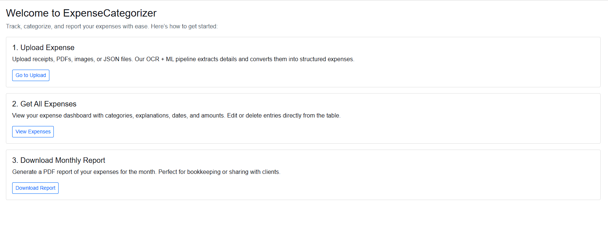
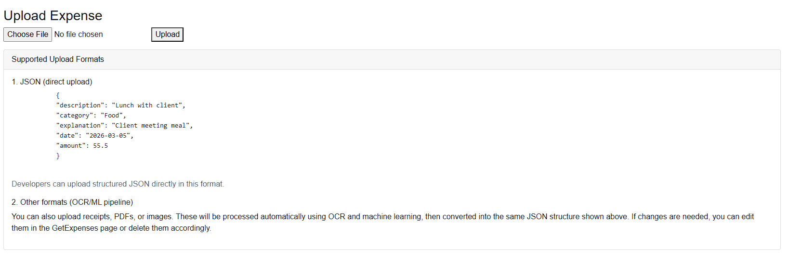
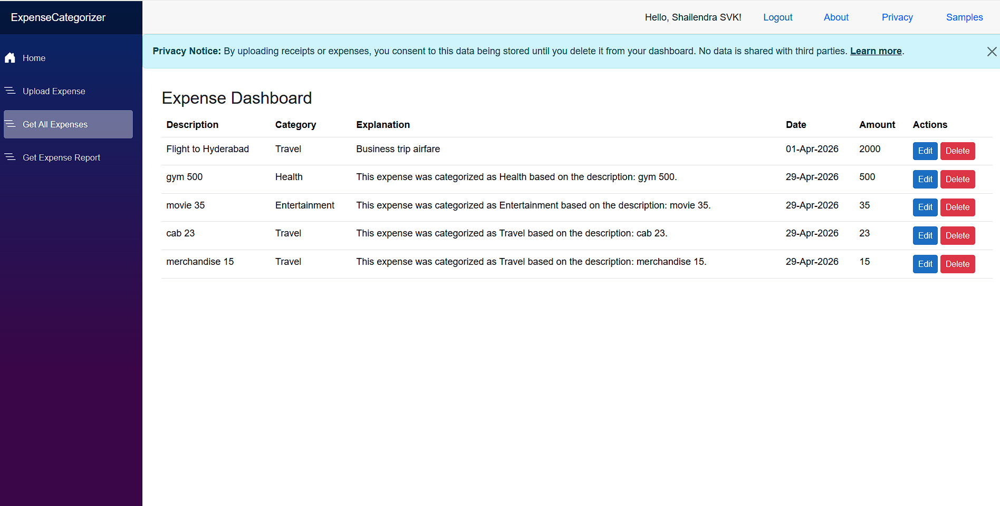
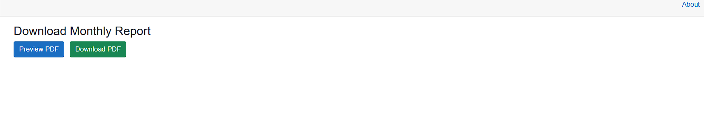
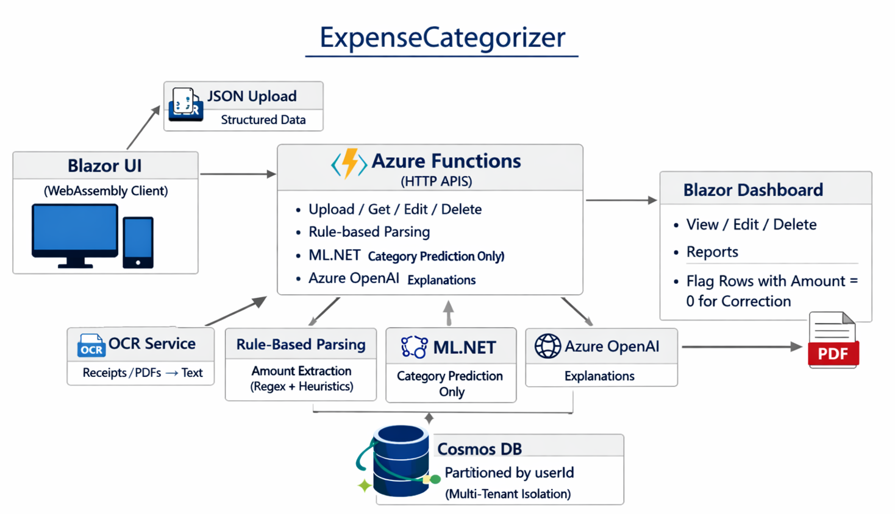

# ExpenseCategorizer
 

A demo-ready portfolio project built with **Blazor WebAssembly**, **Azure Functions**, **Cosmos DB**, **ML.NET**, and **OpenAI API** (explanations with a fallback to ML.NET rule‑based text when quota is exhausted).  
It showcases dual-mode expense uploads, automated categorization, and human-in-the-loop correction.<br>
[Live Site](https://purple-water-04d7b3300.7.azurestaticapps.net/)

---

## 🚀 Features

- **Dual Upload Modes**
  - **JSON Upload**: Strict schema, guaranteed accuracy.
  - **OCR Upload**: Extracts text from receipts/PDFs, predicts categories, and generates explanations.

- **Automated Categorization**
  - ML.NET predicts expense categories (Food, Travel, Utilities, Entertainment, etc.).
  - Explanations are generated via OpenAI API when quota is available; the app falls back to deterministic ML.NET-based explanations if the API is unavailable.
  - Amounts are parsed with rule‑based heuristics (regex + cleaning). ML is used only for category prediction. 

- **Human-in-the-Loop Correction**
  - Inline **Edit/Delete** buttons in the dashboard.
  - Rows with `Amount = 0` are highlighted for quick correction.
  - Users can fix OCR mistakes without losing entries.

- **Cloud-Native Architecture**
  - Blazor WebAssembly frontend.
  - Azure Functions backend APIs (`UploadExpense`, `GetExpenses`, `UpdateExpense`, `DeleteExpense`).
  - Cosmos DB for scalable storage, partitioned by userid for multi tenant isolation.

---

## 📷 Demo Flow

1. Upload a **JSON file** → clean entries saved.
2. Upload a **handwritten receipt** → OCR extracts items, categories predicted, amounts parsed reliably.
3. Upload a **PDF receipt** → OCR extracts items, categories predicted.
4. Dashboard shows all expenses → edit/delete available.
5. Rows with missing amounts (`0`) are flagged → user corrects them.

---

## 🛠️ Tech Stack

- **Frontend**: Blazor WebAssembly
- **Backend**: Azure Functions
- **Database**: Cosmos DB (partitioned by userid)
- **AI Services**: ML.NET (categorization), OpenAI API (explanations with fallback)
- **OCR**: Azure Cognitive Services

---

## 📂 Project Structure

- `ExpenseCategorizer.Shared` → Models
- `ExpenseCategorizer.Client` → Blazor UI
- `ExpenseCategorizerFunction` → Azure Functions
- `DatabaseService.cs` → Cosmos DB integration

---

## ⚙️ Setup
1. Install .NET 8 SDK and Azure Functions Core Tools.
2. Clone the repo:
   git clone https://github.com/svkshailendra/ExpenseCategorizer.git
3. Configure Cosmos DB connection string in local.settings.json.
4. Run the Blazor client:
   dotnet run --project ExpenseCategorizer.Client
5. Run the Functions backend:
   func start

## Configuration

Set these keys in `local.settings.json` for local development and in Azure App Settings for production:

* **`OPENAI_API_KEY`**: Your OpenAI API key.
* **`COSMOS_CONNECTION_STRING`**: Connection string for your Cosmos DB instance.
* **`COMPUTER_VISION_ENDPOINT`** & **`COMPUTER_VISION_KEY`**: Credentials for Azure OCR services.
* **`LLM_PROVIDER`**: *(Optional)* Set to `"openai"` or `"azure"`. Defaults to `"openai"`.

### Example `local.settings.json`
```json
{
  "Values": {
    "FUNCTIONS_WORKER_RUNTIME": "dotnet",
    "OPENAI_API_KEY": "sk-...",
    "COSMOS_CONNECTION_STRING": "...",
    "COMPUTER_VISION_ENDPOINT": "...",
    "COMPUTER_VISION_KEY": "...",
    "LLM_PROVIDER": "openai"
  }
}
```


## 📸 Screenshots
  





## 🗺️ Architecture Overview

The system is composed of:

- **Blazor WebAssembly** frontend for UI.
- **Azure Functions** backend APIs (Upload, Get, Update, Delete).
- **OCR Service** (Azure Cognitive Services) for non‑JSON uploads.
- **ML.NET** for category prediction only.
- **OpenAI API** for generating explanations (with fallback when quota is exhausted).
- **Cosmos DB** for scalable storage, partitioned by userid.
- **Dashboard** for human‑in‑the‑loop correction and reporting.



This project integrates the OpenAI API for natural language explanations. When free quota is exhausted, the system gracefully falls back to deterministic ML.NET-based explanations. In production this can be swapped to Azure OpenAI or another provider for enterprise compliance; provider selection is configurable.
## 🗺️ Roadmap
- Add charts for category totals and monthly trends.
- ~~Multi-user authentication with Azure AD B2C.~~
- Export reports to CSV/Excel.
- Enhanced error handling with toast notifications.

## 🔗 Links

- 🔗 <a href="https://purple-water-04d7b3300.7.azurestaticapps.net/" target="_blank" rel="noopener noreferrer">Live Site</a>
- 👤 <a href="https://www.linkedin.com/in/shailendrasvk/" target="_blank" rel="noopener noreferrer">LinkedIn</a>
- [▶️ Demo Video (Download)](https://github.com/svkshailendra/ExpenseCategorizer/raw/main/docs/ExpenseCategorizer.mp4)
- ✉️ <a href="mailto:svkshailendra@gmail.com">Contact</a>
